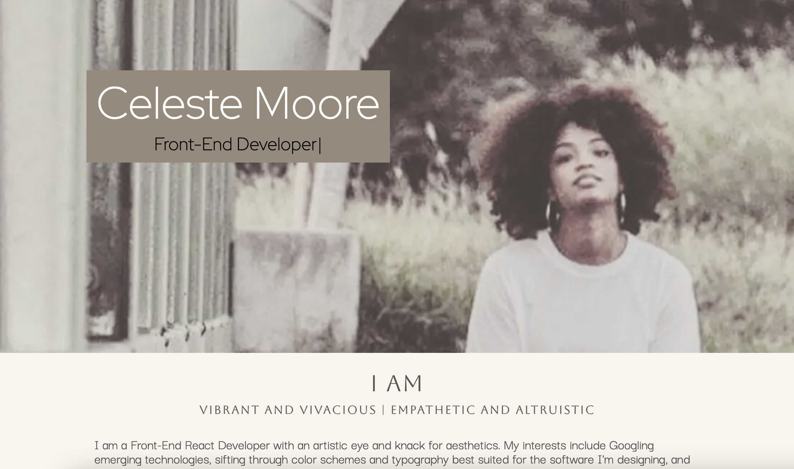

# react_Portfolio

### _This is my updated portfolio with React.js. I created a Parallax effect using CSS for this application. _

## Table of Contents

- [Description](#Description)

- [Media](#Media)

- [Deployed Site](#deployed-site)

- [Features](#Features)

- [Contributors](#Contributors)

- [Contact](#Contact)

- [Project Status](#project-status)

- [License](#License)

## Media

## Deployed Site

   The new link is coming soon. In the meantime, view my current portfolio: (https://celestealexmoore.github.io/Celeste-Moore-Portfolio/)

## Features
    - Single-page application
    - Responsive CSS to adapt to mobile devices
    - Use of Parallax Effect

## Contributors

This website was created by Celeste Moore.

## Contact

If you have any questions about this repository, contact celestealexmoore via GitHub or reach out via email:
celestealexmoore@gmail.com.

## Project Status

Completed

---

## License

© 2021 _celestealexmoore_